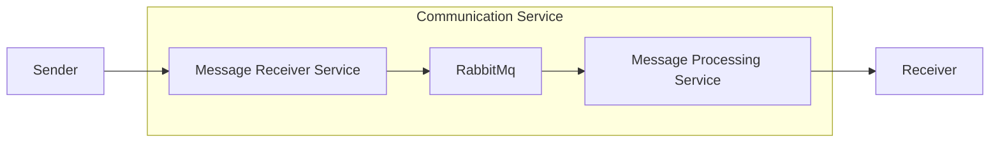
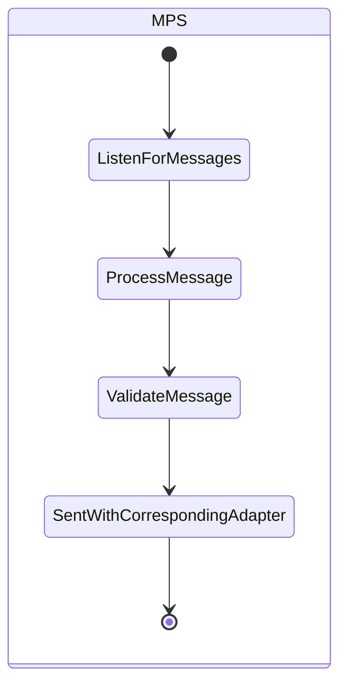

# message-processor-service

The `Message processor service` or also referred as `MPS` is responsible for listening on new messages sent by the `MRS`
on RabbitMq and based on the message channel type to sent it to the corresponding receiver

# Design

# Message Receiver Service

## Dataflow

